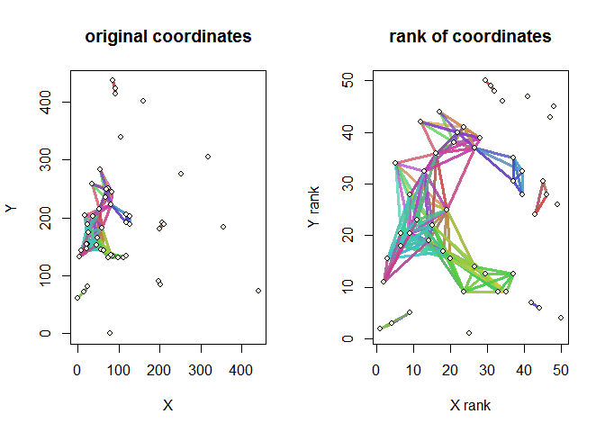
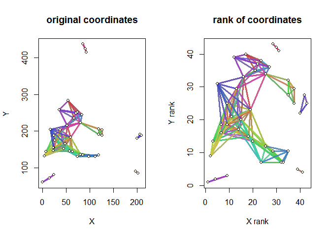
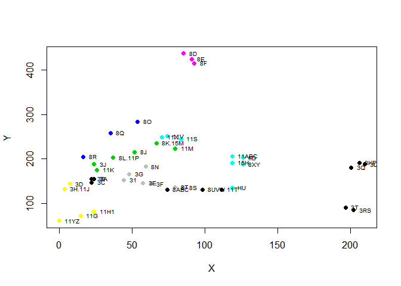
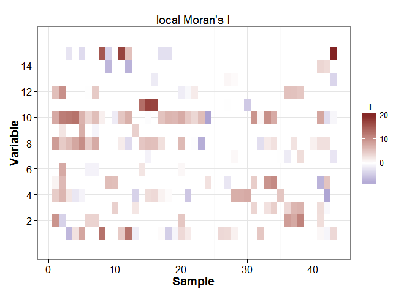
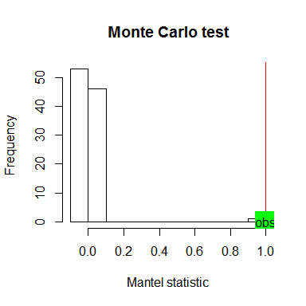
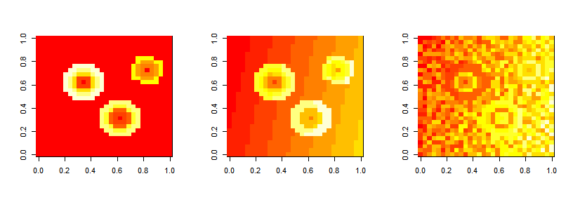
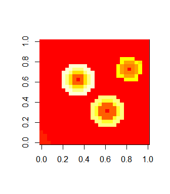
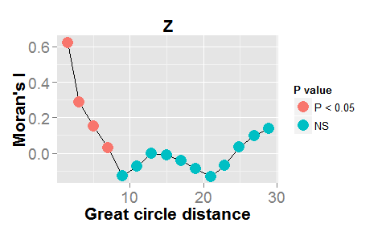
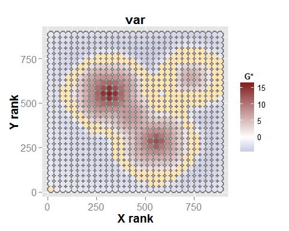

# A short tutorial to EcoGenetics
Leandro Roser - 2016/04/30

  

*An example with real data*
---------------------------

In this first part of the tutorial an analysis is performed with data
published by Sokal et al. (2006). In that work, 43 Yanomama Villages,
located along rivers in Venezuela and Brazil, and 15 allelic frequencies
were analyzed. These data was obtained from a previous study (Sokal et
al., 1986, Tables 1 and 2). First, the coordinates (given in decimal
degrees in the workspace) are projected using the SoDA package:

    require("EcoGenetics")
    require("SoDA")

    ## Warning: package 'SoDA' was built under R version 3.1.3

    data(sokal1986)
    XY<-table.sokal[, 4:5]
    XY <- geoXY(XY[,2], XY[,1], unit=1000)

For a first inspection of the patterns, a correlogram is constructed for
all the villages, using the upper limits for each class listed in Sokal
et al. (1986): 51, 79, 102, 126, 156.195, 236, 292, 352 and 579 km, with
the following command:

    freq <- table.sokal[,6:20]
    cor.I <- eco.correlog(freq, XY = XY, nsim = 999, method = "I", seqvec = c(51, 79, 102, 126, 156,195, 236, 292, 352, 579))

    graph <- plot(cor.I)

We extract some of the data included of the plot output

    graph$multi.correlog

    graph$data$mean.correlogram

    ##            d.mean         obs          lwr         uppr
    ## d=51-79    67.298  0.04762000  0.002153942  0.093086058
    ## d=79-102   90.300 -0.00656000 -0.052343142  0.039223142
    ## d=102-126 111.881 -0.06630000 -0.137359451  0.004759451
    ## d=126-156 140.775 -0.01164000 -0.083201013  0.059921013
    ## d=156-195 176.588 -0.03228000 -0.099334602  0.034774602
    ## d=195-236 213.075 -0.09732667 -0.182931904 -0.011721430
    ## d=236-292 264.997 -0.07470000 -0.156315856  0.006915856
    ## d=292-352 318.622 -0.14018667 -0.265154489 -0.015218845
    ## d=352-579 402.500 -0.13084667 -0.234686152 -0.027007181

The plot shows the correlograms for each allele and the mean correlogram
with the CI's per class obtained by jackknife. The table details for
each interval the mean distance, the observed values of the statistic
and the lower and upper bounds of the jackknife 95% CI.

    wg <- eco.weight(XY, method = "circle",d1=0, d2=51)
    wg

    ## 
    ##  ################### 
    ##   spatial weights 
    ##  ################### 
    ## 
    ##   Method  -->  circle 
    ##   Parameters -->  (d1 = 0) (d2 = 51) 
    ##   Row-standardization -->  FALSE 
    ##   Self-included -->  FALSE 
    ##   Number of individuals -->  50 
    ##   Non-zero (non-self) links -->  12.6 % 
    ##   Individuals with non-zero (non-self) links -->  86 % 
    ##   Average (non-self) links per individual -->  6.2 
    ##   Average distance between connected individuals -->  29.927

    plot(wg)

The graph on the left shows the connections between pairs of villages
(lines). The graph on the right shows the range of the coordinates, as a
way to become independent of the scale, allowing all the points to
appear in the same plot.

To filter the table of coordinates, only those points connected are
retained. As described in the help of eco.weight function (help
(eco.weight)), the information may be obtained with the following
command:

    con <- ecoslot.CONNECTED(wg)

With this data the matrix of coordinates can be filtered, creating a new
weights object. The frequency matrix is also filtered:

    XY.con <- XY[con,]
    wg.con <- eco.weight(XY.con, method = "circle",d1=0, d2=51)
    plot(wg.con)

    table.con <- table.sokal[con, ]
    freq.con <- table.con[,6:20]
    rownames(freq.con) <- table.con[,1]

The resulting populations can be plotted:

    plot(XY.con, col=table.con$Village_cluster, pch=16)
    text(XY.con[,1], XY.con[,2], labels = table.con$Villages,pos = 4, cex = 0.6)

A local analysis is made testing the significances with conditional
permutations (n-1 villages are permuted each time with the exception of
the pivot) for multiple variable, with the following command:

    local <- eco.lsa(freq.con, con=wg.con, method = "I", nsim = 999, conditional = TRUE)

Multiple analysis allows a plot method of variables x samples

    plot(local)

    ## plot options: significant = TRUE
    ## plot options: rescaled = FALSE

It appears that there is not a common local pattern for the different
surfaces of this example.

*---------------------------------------------------------------------*
  

*An example with simulated data*
--------------------------------

The results obtained with the main functions defined in EcoGenetics are
object of class S4. As a default characteristic of the package design,
these objects have a "show" method for a general overview of the
results, and methods to extract the results stored in slots (generic
accessors and double square brackets definitions). The class ecogen has
been designed for handling multidimensional data. Its basic structure is
the following:

-   An *XY* slot, storing a data frame with geographic coordinates.

-   A *P* slot, storing a phenotypic data frame.

-   A *G* slot, storing a genotypic data frame.

-   An *A* slot containing as allelic frequencies the information of G
    (only available for codominant markers.)

-   An *E* slot, storing an environmental data frame.

-   A *S* slot, storing a data frame with classes assigned to the
    individuals.

-   A *C* slot, for a custom data frame.

-   An *OUT* slot, containing a list for the storage of the results.

The following example shows the use of different functions of the
package and of the objects ecogen, implemented for a systematic storage
of information.

    eco.clear()
    data(eco.test)
    ls()

    ## [1] "coordinates" "eco"         "environment" "genotype"    "phenotype"  
    ## [6] "structure"

With the data loaded into the workspace, a new ecogen object is created
as follows:

    eco <- ecogen(XY = coordinates, P = phenotype, G = genotype, E = environment, S = as.data.frame(structure))
    eco

    ## 
    ##                || ECOGEN CLASS OBJECT ||
    ## ----------------------------------------------------------------------------
    ##  Access to slots: <ecoslot.> + <name of the slot> + <(name of the object)> 
    ##  See help("EcoGenetics accessors")
    ## ----------------------------------------------------------------------------
    ## 
    ##  | slot XY:    | --> 225 x 2        coordinates
    ##  | slot P:     | --> 225 x 8        phenotypic variables
    ##  | slot G:     | --> 225 x 10       loci         >> ploidy: 2 || codominant
    ##  | slot A:     | --> 225 x 40       alleles
    ##  | slot E:     | --> 225 x 6        environmental variables
    ##  | slot S:     | --> 225 x 1        structure    >> 1 structure found
    ##  | slot C:     | --> 0 x 0          variables
    ##  | slot OUT:   | --> 0              results
    ## ----------------------------------------------------------------------------

All the objects of the package EcoGenetics have a set of accessors
assigned. The acccesors have the following notation: a prefix
“*ecoslot.*”, followed by the name of the corresponding slot. In the
case of the objects of class ecogen, and for the object "eco" of the
example, the corresponding accessors are: ecoslot.XY(eco),
ecoslot.P(eco), ecoslot.G(eco), ecoslot.A(eco),
ecoslot.E(eco),ecoslot.S(eco), ecoslot.C(eco) and ecoslot.OUT(eco).

The correct assignation of content to the slot of an existent object is
made with accessors. It ensures a basic pre-processing. For example,
creating an object named “eco.temp” it works as follows:

    eco.temp <- ecogen(XY = coordinates, P = phenotype)
    eco.temp

    ## 
    ##                || ECOGEN CLASS OBJECT ||
    ## ----------------------------------------------------------------------------
    ##  Access to slots: <ecoslot.> + <name of the slot> + <(name of the object)> 
    ##  See help("EcoGenetics accessors")
    ## ----------------------------------------------------------------------------
    ## 
    ##  | slot XY:    | --> 225 x 2        coordinates
    ##  | slot P:     | --> 225 x 8        phenotypic variables
    ##  | slot G:     | --> 0 x 0          loci         
    ##  | slot A:     | --> 0 x 0          alleles
    ##  | slot E:     | --> 0 x 0          environmental variables
    ##  | slot S:     | --> 0 x 0          structures   
    ##  | slot C:     | --> 0 x 0          variables
    ##  | slot OUT:   | --> 0              results
    ## ----------------------------------------------------------------------------

    ecoslot.G(eco.temp, order.G = TRUE) <- genotype

    ## Note: ordered genotypes in slot G

    ecoslot.E(eco.temp) <- environment
    ecoslot.S(eco.temp) <- structure
    eco.temp

    ## 
    ##                || ECOGEN CLASS OBJECT ||
    ## ----------------------------------------------------------------------------
    ##  Access to slots: <ecoslot.> + <name of the slot> + <(name of the object)> 
    ##  See help("EcoGenetics accessors")
    ## ----------------------------------------------------------------------------
    ## 
    ##  | slot XY:    | --> 225 x 2        coordinates
    ##  | slot P:     | --> 225 x 8        phenotypic variables
    ##  | slot G:     | --> 225 x 10       loci         >> ploidy: 2 || codominant
    ##  | slot A:     | --> 225 x 40       alleles
    ##  | slot E:     | --> 225 x 6        environmental variables
    ##  | slot S:     | --> 225 x 1        structure    >> 1 structure found
    ##  | slot C:     | --> 0 x 0          variables
    ##  | slot OUT:   | --> 0              results
    ## ----------------------------------------------------------------------------

  
 The available methods for the objects are:  
 
**Subsetting**

    eco.sub <- eco[1:50]
    eco.sub

    ## 
    ##                || ECOGEN CLASS OBJECT ||
    ## ----------------------------------------------------------------------------
    ##  Access to slots: <ecoslot.> + <name of the slot> + <(name of the object)> 
    ##  See help("EcoGenetics accessors")
    ## ----------------------------------------------------------------------------
    ## 
    ##  | slot XY:    | --> 50 x 2         coordinates
    ##  | slot P:     | --> 50 x 8         phenotypic variables
    ##  | slot G:     | --> 50 x 10        loci         >> ploidy: 2 || codominant
    ##  | slot A:     | --> 50 x 40        alleles
    ##  | slot E:     | --> 50 x 6         environmental variables
    ##  | slot S:     | --> 50 x 1         structure    >> 1 structure found
    ##  | slot C:     | --> 0 x 0          variables
    ##  | slot OUT:   | --> 0              results
    ## ----------------------------------------------------------------------------

  
 **Intersection**

    eco1 <- eco
    merged <- eco.merge(eco, eco1)
    merged

    ## 
    ##                || ECOGEN CLASS OBJECT ||
    ## ----------------------------------------------------------------------------
    ##  Access to slots: <ecoslot.> + <name of the slot> + <(name of the object)> 
    ##  See help("EcoGenetics accessors")
    ## ----------------------------------------------------------------------------
    ## 
    ##  | slot XY:    | --> 225 x 4        coordinates
    ##  | slot P:     | --> 225 x 16       phenotypic variables
    ##  | slot G:     | --> 225 x 20       loci         >> ploidy: 2 || codominant
    ##  | slot A:     | --> 225 x 80       alleles
    ##  | slot E:     | --> 225 x 12       environmental variables
    ##  | slot S:     | --> 225 x 2        structures   >> 2 structures found
    ##  | slot C:     | --> 0 x 0          variables
    ##  | slot OUT:   | --> 0              results
    ## ----------------------------------------------------------------------------

  
 **Subsetting by group of the slot “S”**

    eco.subS <- eco.subset(eco,"pop", 1)
    eco.subS

    ## 
    ##                || ECOGEN CLASS OBJECT ||
    ## ----------------------------------------------------------------------------
    ##  Access to slots: <ecoslot.> + <name of the slot> + <(name of the object)> 
    ##  See help("EcoGenetics accessors")
    ## ----------------------------------------------------------------------------
    ## 
    ##  | slot XY:    | --> 174 x 2        coordinates
    ##  | slot P:     | --> 174 x 8        phenotypic variables
    ##  | slot G:     | --> 174 x 10       loci         >> ploidy: 2 || codominant
    ##  | slot A:     | --> 174 x 40       alleles
    ##  | slot E:     | --> 174 x 6        environmental variables
    ##  | slot S:     | --> 174 x 1        structure    >> 1 structure found
    ##  | slot C:     | --> 174 x 0        variables
    ##  | slot OUT:   | --> 0              results
    ## ----------------------------------------------------------------------------

  
 **Union by row**

    eco1 <- eco
    rownames(ecoslot.P(eco)) <- 226:450 # duplicate names are not allowed
    eco.r <- eco.rbind(eco, eco1)  # some matrices with duplicated names

    ## The <XY> data frames have duplicated row names. 
    ##                                Duplicated row names are not allowed.
    ##                                This will generate an empty <XY> slot.
    ## The <G> data frames have duplicated row names. 
    ##                                Duplicated row names are not allowed.
    ##                                This will generate an empty <G> slot.
    ## The <E> data frames have duplicated row names. 
    ##                                Duplicated row names are not allowed.
    ##                                This will generate an empty <E> slot.
    ## The <S> data frames have duplicated row names. 
    ##                                Duplicated row names are not allowed.
    ##                                This will generate an empty <S> slot.

    eco.r

    ## 
    ##                || ECOGEN CLASS OBJECT ||
    ## ----------------------------------------------------------------------------
    ##  Access to slots: <ecoslot.> + <name of the slot> + <(name of the object)> 
    ##  See help("EcoGenetics accessors")
    ## ----------------------------------------------------------------------------
    ## 
    ##  | slot XY:    | --> 0 x 0          coordinates
    ##  | slot P:     | --> 450 x 8        phenotypic variables
    ##  | slot G:     | --> 0 x 0          loci         
    ##  | slot A:     | --> 0 x 0          alleles
    ##  | slot E:     | --> 0 x 0          environmental variables
    ##  | slot S:     | --> 0 x 0          structures   
    ##  | slot C:     | --> 0 x 0          variables
    ##  | slot OUT:   | --> 0              results
    ## ----------------------------------------------------------------------------

  
 **Union by column**

    eco1 <- eco
    eco.c <- eco.cbind(eco, eco1)

    ## Note: null or duplicated column names. using generic labels.

    eco.c

    ## 
    ##                || ECOGEN CLASS OBJECT ||
    ## ----------------------------------------------------------------------------
    ##  Access to slots: <ecoslot.> + <name of the slot> + <(name of the object)> 
    ##  See help("EcoGenetics accessors")
    ## ----------------------------------------------------------------------------
    ## 
    ##  | slot XY:    | --> 225 x 2        coordinates
    ##  | slot P:     | --> 225 x 16       phenotypic variables
    ##  | slot G:     | --> 225 x 20       loci         >> ploidy: 2 || codominant
    ##  | slot A:     | --> 225 x 80       alleles
    ##  | slot E:     | --> 225 x 12       environmental variables
    ##  | slot S:     | --> 225 x 2        structures   >> 2 structures found
    ##  | slot C:     | --> 0 x 0          variables
    ##  | slot OUT:   | --> 0              results
    ## ----------------------------------------------------------------------------

  
 **Ordering by row, using as reference the order of the slot XY**

    eco1 <- eco
    ecoslot.P(eco1) <- ecoslot.P(eco1)[sample(1:173),] # unordered rows in slot P
    eco1

    ## 
    ##                || ECOGEN CLASS OBJECT ||
    ## ----------------------------------------------------------------------------
    ##  Access to slots: <ecoslot.> + <name of the slot> + <(name of the object)> 
    ##  See help("EcoGenetics accessors")
    ## ----------------------------------------------------------------------------
    ## 
    ##  | slot XY:    | --> 225 x 2        coordinates
    ##  | slot P:     | --> 173 x 8        phenotypic variables
    ##  | slot G:     | --> 225 x 10       loci         >> ploidy: 2 || codominant
    ##  | slot A:     | --> 225 x 40       alleles
    ##  | slot E:     | --> 225 x 6        environmental variables
    ##  | slot S:     | --> 225 x 1        structure    >> 1 structure found
    ##  | slot C:     | --> 0 x 0          variables
    ##  | slot OUT:   | --> 0              results
    ## ----------------------------------------------------------------------------

    ordered <- eco.order(eco1)
    ecoslot.P(ordered)                                 # ordered rows in slot P

    ## [1] P1 P2 P3 P4 P5 P6 P7 P8
    ## <0 rows> (or 0-length row.names)

    ordered

    ## 
    ##                || ECOGEN CLASS OBJECT ||
    ## ----------------------------------------------------------------------------
    ##  Access to slots: <ecoslot.> + <name of the slot> + <(name of the object)> 
    ##  See help("EcoGenetics accessors")
    ## ----------------------------------------------------------------------------
    ## 
    ##  | slot XY:    | --> 225 x 2        coordinates
    ##  | slot P:     | --> 0 x 8          phenotypic variables
    ##  | slot G:     | --> 225 x 10       loci         >> ploidy: 2 || codominant
    ##  | slot A:     | --> 225 x 40       alleles
    ##  | slot E:     | --> 225 x 6        environmental variables
    ##  | slot S:     | --> 225 x 1        structure    >> 1 structure found
    ##  | slot C:     | --> 0 x 0          variables
    ##  | slot OUT:   | --> 0              results
    ## ----------------------------------------------------------------------------

A mantel test for the P and A data, can be performed as follows:

    set.seed(10)
    mantel.PE <- eco.mantel(dist(ecoslot.P(eco)), dist(ecoslot.P(eco)), nsim = 99)

The object “eco2” included in the package contains point patterns in a
grid of 30 x 30 pixels, simulating phenoypic data:

    data(eco2)
    par(mfrow=c(1,3))
    image(matrix(ecoslot.P(eco2)[,1], 30, 30))
    image(matrix(ecoslot.P(eco2)[,2], 30, 30))
    image(matrix(ecoslot.P(eco2)[,3], 30, 30))

The Figure shows the three first variables of the slot P in the object
eco2. The first variable has a local pattern, while the second and third
include linear global gradients (the third also has random noise). The
effect caused by the global pattern over the variable can be removed
with a trend surface analysis (Borcard y col., 2011) using the function
eco.detrend, performing a regression for each trait (z) over the polynom
of degree n of the spatial coordinates (x, y). This example uses the
polynom of degree 1.

To remove the global trend in direction SE-NW over the second of the
images shown in the Figure 4.3, a fist degree polynom of the spatial
coordinates (zi = a1 + a2x +a3y) is used:

    det <- eco.detrend(eco2[["P"]][,2], eco2[["XY"]][,1:2], degree = 1)
    sim.det <- data.frame(matrix(0, 900,3))
    sim.det[,1:2] <- eco2[["XY"]]
    sim.det[, 3]<-ecoslot.RES(det)
    par(mfrow = c(1,1))
    image(matrix(sim.det[,3], 30, 30))

The figure above shows the resulting image after the remotion of the
global trend.

The trend was removed and the data is now ready to be analyzed, for
example, computing a Moran correlogram:

    cordata <- eco.correlog(Z = sim.det[,3], XY = sim.det[,1:2], int = 2, smax = 30)

    plot(cordata)

The variable shows a decreasing trend from positive to negative values,
and then stabilizes. The local patterns can be analyzed with the Gi\*
statistic. First, a is created for the 20 nearest-neighbors of each
pivotal individual, included the self-connection:

    weight.con <- eco.weight(sim.det[,1:2], method = "knearest", k = 10, 
    self = TRUE)
    weight.con

    ## 
    ##  ################### 
    ##   spatial weights 
    ##  ################### 
    ## 
    ##   Method  -->  knearest - min 
    ##   Parameters -->  (k = 10) 
    ##   Row-standardization -->  FALSE 
    ##   Non-zero (non-self) links -->  5.5 % 
    ##   Number of individuals -->  900 
    ##   Individuals with non-zero (non-self) links -->  100 % 
    ##   Average (non-self) links per individual -->  49.5 
    ##   Average distance between connected individuals -->  2.852

These weights can now be used for the local analysis:

    get <- eco.lsa(var = sim.det[,3],con = weight.con, method = "G*", 
    nsim = 999)

    plot(get, significant = TRUE)

    ## plot options: significant = TRUE
    ## plot options: rescaled = FALSE

The result can be stored in the ecogen object. Several results are
assigned as list:

    ecoslot.OUT(eco2) <- list(get, cordata, weight.con)
    ecoslot.OUT(eco2)

    ##      OBJECTS        CLASSES
    ## 1    cordata | eco.correlog
    ## 2        get |      eco.lsa
    ## 3 weight.con |   eco.weight

The slot can be managed as a list.

The stored objects can be accessed as follow:

    ecoslot.OUT(eco2, "cordata")

    ## $cordata
    ## 
    ##  ############################ 
    ##    Moran's I 
    ##  ############################ 
    ## 
    ##   > Number of simulations -->  99 
    ##   > Random test -->  permutation 
    ##   > P-adjust method -->  holm -sequential: TRUE 
    ## 
    ##   >  ecoslot.OUT(x): results -->  
    ## 
    ## $Z
    ##         d.mean     obs p.val  size
    ## d=0-2    1.466  0.6236  0.01  5102
    ## d=2-4    3.081  0.2856  0.02 14152
    ## d=4-6    5.028  0.1518  0.03 22886
    ## d=6-8    6.987  0.0291  0.04 27238
    ## d=8-10   9.003 -0.1290  0.05 34802
    ## d=10-12 10.945 -0.0729  0.06 32340
    ## d=12-14 12.915 -0.0018  0.45 39418
    ## d=14-16 14.940 -0.0089  0.14 36782
    ## d=16-18 16.916 -0.0404  0.09 36484
    ## d=18-20 18.945 -0.0862  0.10 35906
    ## d=20-22 20.965 -0.1307  0.11 31014
    ## d=22-24 22.899 -0.0700  0.12 26452
    ## d=24-26 24.897  0.0350  0.13 23818
    ## d=26-28 26.907  0.0970  0.14 16898
    ## d=28-30 28.888  0.1395  0.15 11382
    ## 
    ## 
    ##  Results table(s) in ecoslot.OUT(x) 
    ## 
    ##  -------------------------------------------------------------
    ##   Slot access: <ecoslot.> + <slot name> + <(object x name)> 
    ##   See help("EcoGenetics accessors")
    ##  -------------------------------------------------------------

The objects can be removed as follow:

     eco2 <- eco.remove(eco2, cordata) 
     ecoslot.OUT(eco2)

    ##      OBJECTS      CLASSES
    ## 1        get |    eco.lsa
    ## 2 weight.con | eco.weight

Finally, the workspace can be cleaned storing only the created object:

    eco.clear(eco2)

References
----------

Borcard D., F. Gillet, and P. Legendre. 2011. Numerical ecology with R.
Springer Science & Business Media.

Sokal R. 1986. Spatial data analysis and historical processes. In: E.
Diday, Y. Escoufier, L. Lebart, J. Pages, Y. Schektman, and R.
Tomassone, editors. Data analysis and informatics, IV. North-Holland,
Amsterdam, The Netherlands, pp. 29-43.

Sokal R., and B. Thomson. 2006. Population structure inferred by local
spatial autocorrelation: an example from an Amerindian tribal
population. American journal of physical anthropology, 129: 121-131.

*---------------------------------------------------------------------*
  
